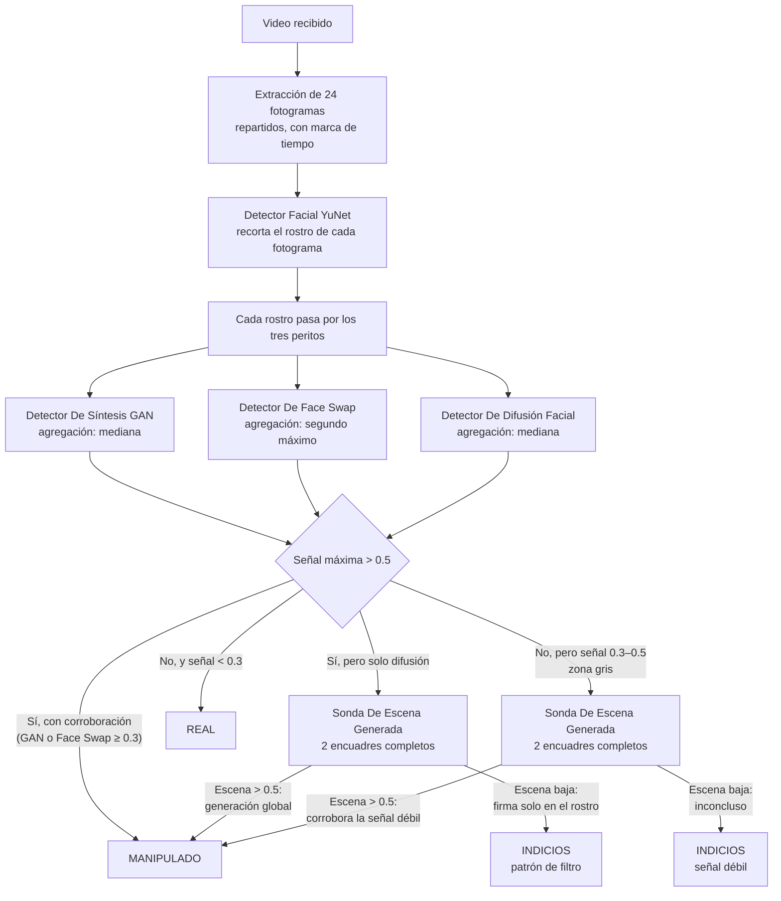

# Modelos Y Procedimiento De Determinación

Este documento describe, paso a paso, cómo CertiFace determina si un video (o
una imagen) es **real** o **falso**, y cataloga cada modelo de este
directorio con su **Nombre Estándar** — formato de escritura con mayúscula
inicial en cada palabra — que es la forma canónica de referirse a ellos en
documentación, informes periciales y comunicación del equipo.

---

## Catálogo De Modelos

| Nombre Estándar | Archivo | Arquitectura | Entrenado Sobre | Función | Licencia |
|---|---|---|---|---|---|
| **Detector Facial YuNet** | `Detector_Facial_YuNet.onnx` (227 KB) | YuNet (DNN, ONNX) | Rostros en contexto general | Localiza y recorta el rostro más grande de cada fotograma | MIT |
| **Detector De Síntesis GAN** | `Detector_De_Sintesis_GAN.pth` (16 MB) | EfficientNet-B0 | 140k Real and Fake Faces (StyleGAN) | Reconoce rostros 100 % sintéticos de GAN clásica | Propio |
| **Detector De Face Swap** | `Detector_De_Face_Swap.pth` (267 MB) | EfficientNet-B7 noisy-student | DFDC — Deepfake Detection Challenge | Reconoce caras intercambiadas en video | MIT ([ganador del DFDC](https://github.com/selimsef/dfdc_deepfake_challenge)) |
| **Detector De Difusión Facial** | `Detector_De_Difusion_Facial/` (355 MB) | SigLIP2 base, 512 px | OpenDeepfake-Preview (rostros de generación moderna) | Reconoce rostros generados por difusión | Apache 2.0 ([origen](https://huggingface.co/prithivMLmods/deepfake-detector-model-v1)) |
| **Sonda De Escena Generada** | `Sonda_De_Escena_Generada/` (2 GB) | SigLIP2-SO400M + DINOv2-L (LoRA fusionado) | OpenFake — ~100k imágenes generales, 25+ generadores | Reconoce generación en el **encuadre completo**, no solo el rostro | MIT ([origen](https://huggingface.co/Bombek1/ai-image-detector-siglip-dinov2)) |

Correspondencia con las claves de la API (`models` en la respuesta de
`POST /predict`):

| Nombre Estándar | Clave API | Etiqueta En La Interfaz |
|---|---|---|
| Detector De Síntesis GAN | `synthesis_gan` | GAN |
| Detector De Face Swap | `faceswap_dfdc` | FACE SWAP |
| Detector De Difusión Facial | `diffusion_modern` | DIFUSIÓN |
| Sonda De Escena Generada | `scene_generated` | ESCENA |

Todos los pesos se cargan desde este directorio en el arranque, en modo
seguro (`torch.load` con `weights_only`); los checkpoints de terceros se
convirtieron una única vez a archivos de solo-tensores. No hay descargas en
tiempo de ejecución.

> ⚠️ **Los tres pesos grandes no se versionan en git** (límite de 100 MB por
> archivo de GitHub). En un clon nuevo, reconstrúyelos con
> `python scripts/fetch_models.py` desde `backend/` — descarga de las fuentes
> oficiales listadas abajo y aplica las mismas conversiones.

## Enlaces De Origen

Procedencia exacta de cada modelo y qué transformación se le aplicó al
incorporarlo:

| Nombre Estándar | Origen | Transformación aplicada |
|---|---|---|
| **Detector Facial YuNet** | [opencv/opencv_zoo — face_detection_yunet](https://github.com/opencv/opencv_zoo/tree/main/models/face_detection_yunet) (archivo `face_detection_yunet_2023mar.onnx`) | Ninguna; se usa el ONNX oficial tal cual |
| **Detector De Síntesis GAN** | Entrenamiento propio en Google Colab sobre el dataset [140k Real and Fake Faces](https://www.kaggle.com/datasets/xhlulu/140k-real-and-fake-faces) (Kaggle, xhlulu) | Ninguna |
| **Detector De Face Swap** | [selimsef/dfdc_deepfake_challenge — release 0.0.1](https://github.com/selimsef/dfdc_deepfake_challenge/releases/tag/0.0.1), checkpoint `final_888_DeepFakeClassifier_tf_efficientnet_b7_ns_0_40` | Convertido a archivo de solo-tensores (el checkpoint original de 2020 traía metadatos numpy incompatibles con el modo seguro de `torch.load`) |
| **Detector De Difusión Facial** | [prithivMLmods/deepfake-detector-model-v1](https://huggingface.co/prithivMLmods/deepfake-detector-model-v1) (Hugging Face) | Se descartaron los checkpoints intermedios de entrenamiento; se conserva solo `model.safetensors` y sus configs |
| **Sonda De Escena Generada** | [Bombek1/ai-image-detector-siglip-dinov2](https://huggingface.co/Bombek1/ai-image-detector-siglip-dinov2) (Hugging Face) | Convertido a solo-tensores; los adaptadores LoRA se fusionan en los backbones al cargar (equivalente en inferencia). Incluye los configs del backbone [google/siglip2-so400m-patch14-384](https://huggingface.co/google/siglip2-so400m-patch14-384) para construir sin red |

---

## Procedimiento De Determinación En Video

### Paso 1 — Ingesta Y Extracción

El video se valida (formato, ≤ 10 MB) y se escriben hasta **24 fotogramas
muestreados a intervalos regulares** de toda la línea de tiempo, cada uno con
su marca de tiempo en segundos. Si OpenCV no puede decodificar el códec, el
análisis se detiene con un error explícito (HTTP 422) — nunca se emite
veredicto sobre material ilegible.

### Paso 2 — Recorte Facial

El **Detector Facial YuNet** localiza el rostro más grande de cada fotograma
y lo recorta con un margen del 35 %. Esto es determinante: los peritos fueron
entrenados con rostros que ocupan todo el encuadre, y pasarles el fotograma
entero haría que el fondo dominara el veredicto. Si un fotograma no tiene
rostro detectable se analiza completo y queda registrado; si ningún fotograma
tiene rostro, el dictamen lo advierte (`faces_detected: 0`).

### Paso 3 — Evaluación Por Los Tres Peritos

Cada recorte facial pasa por los tres especialistas, cada uno experto en una
familia de manipulación distinta:

- **Detector De Síntesis GAN** — busca los artefactos de textura de las GAN
  clásicas (StyleGAN).
- **Detector De Face Swap** — busca los bordes de mezcla e inconsistencias
  del intercambio de caras.
- **Detector De Difusión Facial** — busca la firma de los generadores
  modernos por difusión.

Cada uno emite una probabilidad de manipulación **por fotograma**, visible en
el log (`p_gan`, `p_swap`, `p_diff`).

### Paso 4 — Agregación Por Familia

Cada familia resume sus 24 puntuaciones según la naturaleza de su artefacto:

| Familia | Estadística | Razón forense |
|---|---|---|
| Síntesis GAN | **Mediana** | Una cara generada lo es en todos los fotogramas; la mediana resiste picos y valles atípicos |
| Face Swap | **Segundo Máximo** | Los artefactos del swap son intermitentes (pose, expresión, luz); se exigen **dos detecciones independientes** — un pico único de ruido no condena |
| Difusión Facial | **Mediana** | Igual que la GAN: la generación afecta a todo el video por igual |

### Paso 5 — Decisión Y Resolución De Ambigüedad

La señal más alta de las tres decide. Sobre esa base:

1. **Condena corroborada** (la señal ganadora supera 0.5 y GAN o Face Swap
   participan con ≥ 0.3) → **MANIPULADO**, con la confianza de la señal
   ganadora.
2. **Condena solo por difusión** (los otros dos limpios) → ambigüedad
   conocida: los filtros de embellecimiento producen la misma firma facial
   que la generación. Se invoca la **Sonda De Escena Generada** sobre 2
   encuadres completos (solo si hay suficientes fotogramas donde el rostro no
   domina): firma también en el entorno → **MANIPULADO** (generación global);
   firma solo en el rostro → **INDICIOS** (patrón de filtro); sin encuadres
   contrastables → **INDICIOS** prudente.
3. **Zona gris** (ninguna señal supera 0.5, pero la difusión queda entre 0.3
   y 0.5) → los generadores recientes pueden dejar firmas atenuadas en esa
   franja, verificado empíricamente. La Sonda De Escena Generada decide: si
   el encuadre completo delata generación → **MANIPULADO**; si no →
   **INDICIOS** (inconcluso).
4. **Sin señal** (todo por debajo de 0.3) → **REAL**, con confianza
   `1 − señal máxima`.

La sonda solo se paga en los casos 2 y 3 (~1 minuto extra); los veredictos
claros no la ejecutan.

### Paso 6 — Dictamen

| Sello | Valor API | Significado |
|---|---|---|
| **MANIPULADO** (naranja) | `Fake` | Manipulación detectada, con corroboración o generación global confirmada |
| **INDICIOS** (ámbar, borde discontinuo) | `Suspect` | Señal sin corroborar o inconclusa; el campo `caveat` explica la reserva y el perito decide con las métricas |
| **REAL** (moss) | `Real` | Los tres peritos limpios; el porcentaje orienta la decisión del perito |

El dictamen incluye siempre el desglose por modelo (la señal decisoria
marcada con ▸), los fotogramas analizados y con rostro, la puntuación por
fotograma (`frame_scores`) y los **momentos sospechosos** con marca de tiempo
(`suspicious_seconds`, fotogramas de face swap > 0.6) para revisión manual
directa en la línea de tiempo.

### Imágenes

El procedimiento es el mismo con un solo "fotograma": recorte facial, tres
peritos, y las mismas reglas de reserva y zona gris usando la imagen completa
como encuadre para la Sonda De Escena Generada.

---

## Límites Declarados

Cada perito conoce su familia y su época. Manipulaciones de familias no
vistas en entrenamiento —face swap comercial de última generación,
reenactment, generadores futuros— pueden atenuarse hasta la zona gris o
escapar. El diseño de tres sellos garantiza que la incertidumbre nunca se
presenta como certeza: cuando el sistema no puede corroborar, lo dice
(**INDICIOS**) y entrega las métricas para que decida el perito.
